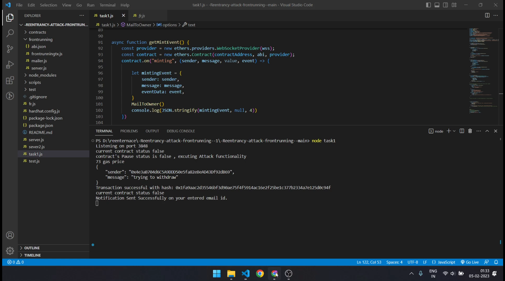
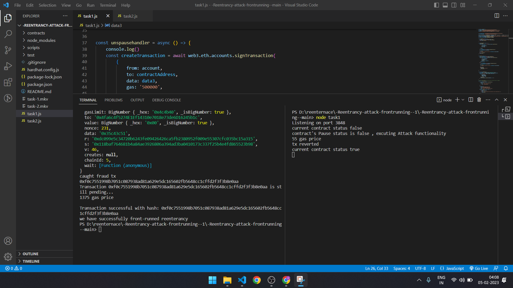

# Front-Running a TX with web3 and 

This project demonstrates a basic Front Running of a Transaction. A test for that contract, script to watch mempool of the Goerli Testnet to when a Tx from a particular contract is executed, and then script will execute another tx to stop the first Tx.

## Tech Stack 
1) Solidity (language used for smart contract)
2) Web3 and ethers (To interact with blockchain )
3) Hardhat (For testing smart contract)
4) Express.js (To create environment)
5) Alchemy  (for Test Node)


## Goerli testnet address : 0x4fa6c4f5274E1Ef14310e7018e73de6D16245b1c

lib in ERC20 smart contract :
1) ERC20
2) ownable
3) pauseable 

A ERC20 smart contract with reentrancy vulnerable function named as "vulnerable" which mint in the account of the given address parameter,
it contains Event minting which is used to notify owner that particular function is invoked.


## Task-1 : Notify owner for reenterancy 
using websocket url from alchemy and inserting it with `new ethers.providers.WebSocketProvider(wss)` from ether to render event from contract 
with a microservice a mail is sent as the notification to owner given mail with details from the mempool of transaction while tx is still in pending.
scanning mempool to find the tx that is "vulnerable", and details around it.
Then see if the next tx is from the same address and can flag it as suspicious transaction, 
once flagged second tx will be frontrunned by the 3rd tx which will pause the miniting process as we already have "pausable" functionality in the smartcontract.


## Task-2 : Front Run Transaction Previously Excuted 

1) Getting contract details to create an instance of the contract , for example we are using the above contract,
    vulenerable function is exposed to public but it has a **Modifier** pauseable which ensure the status of the smart contract.

2) If a tx is found from the contract address in mempool scanning , that will tigger function **changepauseable** to change the state of contract.<br>
    2.1)**false** : open to attack <br>
    2.2)**true** : paused and won't allow minting <br>

3) Sending a tx before the first tx which should be executed before the first Tx

4) Gas of the second tx should be more then 75k and less the GasBlock limit.

5) Transaction with higher gas fees is executed first and will change the status of the contract to **True**

6) And first tx gas fee should be less then the second tx, Front running is Done.

Please review video and screenshot that are attached with code.

## Steps 
1) npm install for installing the dependencies
2) To run Task1 use `npm run task1`
3) To run Task2 use `npm run task2`


Try running some of the following tasks:

```shell
npx hardhat test
npx hardhat node --fork https://eth-mainnet.g.alchemy.com/v2/<YOUR API KEY>
npm run task1  Notify owner with email.
npm run task2  Front Running 
```


Above image is showcasing the notification is sent to given address via catching event `miniting` from smart contract after sending a successfully 



Above image is showcasing front running of the transaction , via websocket using web3js and sending more Gas then previous transaction.


## Disclaimer 

This projcet is test case with controlled variable , It is only for testing purpose as the front running depends on various factor and tx could revert with **impermanent loss** caution is advised. 


